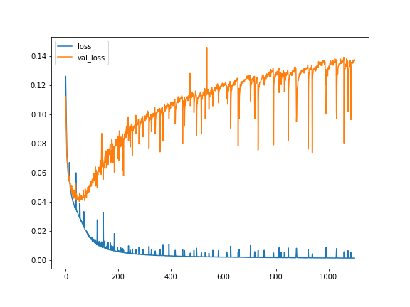
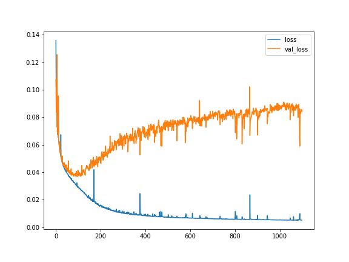
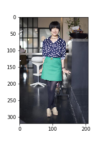
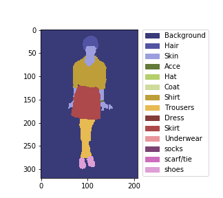
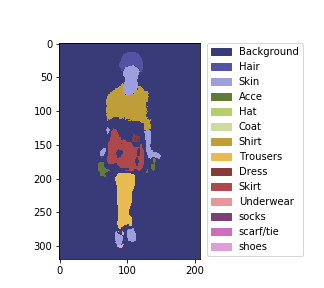
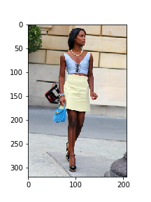
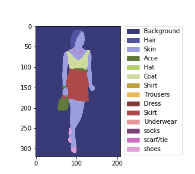
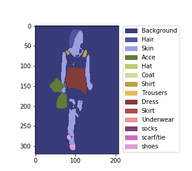

# Image Segmentation with KERAS
### Main dependencies
- python 3.5.2
- Tensorflow 1.8.0
- KERAS 2.2.2

## Brain Tumours dataset with 3D-UNet
[Medical Segmentation Decathlon - Brain Tumours (BRATS 2016 and 2017 datasets)](http://medicaldecathlon.com/)
 
### Model
- Simple 3D U-Net
- Loss function: binary_crossentropy
- optimizer: Adadelta

### Training
- Training strategy
  - Image Size: 240x240x155
  - Model trained with 388 images, validated with 48 images, test with 48 images.
  - Patch Size: 64x64x64
  
- Training option:
`"Num_epoch": 1000,
	"Steps_per_epoch" : 50,
	"Batch_size": 4`
  
 
### Result

Test on test set.

|Image|Ground Truth|Predicted|
|-----|---------|--------------|
||||

Average WT dice scores: 0.796

Average TC dice scores: 0.728

Average ET dice scores: 0.631

### Reference:
 - [tkuanlun350/3DUnet-Tensorflow-Brats18](https://github.com/tkuanlun350/3DUnet-Tensorflow-Brats18)
 - [ellisdg/3DUnetCNN](https://github.com/ellisdg/3DUnetCNN)

## CCP dataset with UNet

[Clothing Co-Parsing (CCP) dataset](https://github.com/bearpaw/clothing-co-parsing)

reference: [Multi-Class U-Net for Segmentation of Non-Biometric Identifiers](https://www.fer.unizg.hr/_download/repository/IMVIP_2017_HrkacBrkicKalafatic.pdf)

### Model
- U-Net as shown in reference
- Loss function: binary_crossentropy
- optimizer: Adadelta

### Training
- Training strategy
  - resize image shape to 320x208
  - Simplified 59 tags to 14 tags 
  - Model trained with 704 images, validated with 100 images, test with 200 images.
  - Data augmentation:
    horizontal flip/noise/averaging blurring/horizontal shift/rotation
  
- Training option:
`"Num_epoch": 1100,
	"Steps_per_epoch" : 100,
	"Batch_size": 16`

	
### Result

- history of loss in training set and validation set

|No data augmentation|With data augmentation|
|-------------------|-----------------------|
|| |
|lowest loss:0.00145 lowest vali_loss:0.03872|lowest loss:0.00513 lowest vali_loss:0.03681|

- Results of the best validated model, test on test set

|Image|True mask|Predicted mask|
|-----|---------|--------------|
||||
||||

- Evaluation of metrics on test set

##### mean IoU of each class:

IoU definition: TP/(FN+TP+FP)

mean IoU: sum of IoU/(number of valid events which contain the class)

|background|hair |skin |accessories|hat  |coat     |shirt|
|----------|-----|-----|-----------|-----|---------|-----|
|0.975|0.583|0.708|0.263|0.002|0.171|0.392|

|trousers  |dress|skirt|underwear  |socks|scarf/tie|shoes|
|----------|-----|-----|-----------|-----|---------|-----|
|0.447|0.263|0.025|0.000|0.027|0.000|0.642|

##### mean precision of each class: 

precision definition: TP/(TP+FP)

mean precision: sum of precision/(number of valid events which contain the class)
	
|background|hair |skin |accessories|hat  |coat     |shirt|
|----------|-----|-----|-----------|-----|---------|-----|
|0.983|0.723|0.801|0.359|0.002|0.342|0.639|

|trousers  |dress|skirt|underwear  |socks|scarf/tie|shoes|
|----------|-----|-----|-----------|-----|---------|-----|
|0.722|0.500|0.044|0.000|0.037|0.000|0.750|

Some classes are very few (hat, underwear, scarf/tie), 
and some classes are confused (coat/shirt/trousers/dress).

### To-do
- fine tune model to solve overtraining
- Implement other semantic segmentation model

