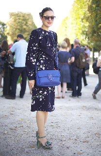
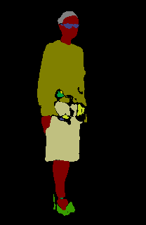

# Image Segmentation

## CCP dataset with UNet

reference: [Multi-Class U-Net for Segmentation of Non-Biometric Identifiers](https://www.fer.unizg.hr/_download/repository/IMVIP_2017_HrkacBrkicKalafatic.pdf)

### Main dependencies
- python 3.5.2
- Tensorflow 1.8.0
- KERAS 2.2.2

### Training
- Training strategy
  - Simplified 59 tags to 14 tags 
  - Training with 1004 images with precise pixel-level annotations.
  - Test on other images with only image-level annotations and look with eyes :eyes:
  
- Training option:
`"Num_epoch": 100,
	"Steps_per_epoch" : 100,
	"Batch_size": 16`
  
  First time: `loss: 0.0178 - acc: 0.9936`
  
  Second time: `loss: 0.0071 - acc: 0.9974`
  
### Result
- Look with eyes :flushed:

### To-do
- Split data with pixel-level annotations into train/vali/test, evaluate the test set
- Data augmentation with img/mask

 

## Plan

1. implement a famous model and train/test on a famous dataset. For example, U-Net.

2. build the model for a dataset/challenge and fine-tune.

[Clothing Co-Parsing (CCP) dataset](https://github.com/bearpaw/clothing-co-parsing)

[ISBI](https://grand-challenge.org/challenges/)

